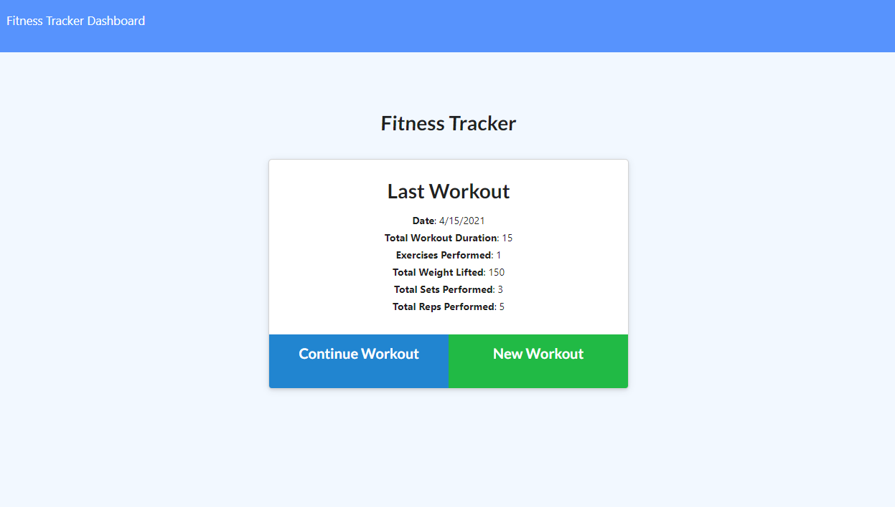
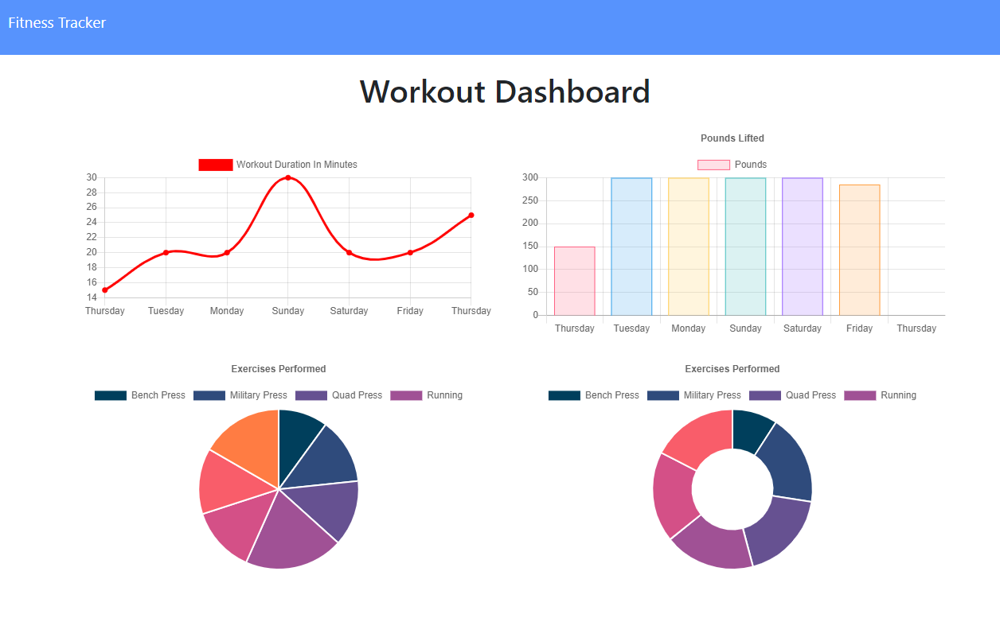

  # Fitness Tracker 

  
  ## Description
  Allows user to track their workout and view via a dynami dashboard of graphs and charts. Uses Express, Node, Mongoose and MongoDB. Dashboard shows last 7 workouts from the database.  

  [Project Link](https://gentle-hollows-81737.herokuapp.com/)

  ## Table of Contents

  * [Installation](#installation)
  * [Usage](#usage)
  * [License](#license)
  * [Contributing](#contributing)
  * [Tests](#tests)
  * [Questions](#questions)

  ## Installation

  npm i

  ## Usage

  node server.js

  ## License

  This project is licensed under the MIT license.

  
  

  npm test

  ## Questions
  If you have any questions please email me at jasoncjorgensen@gmail.com.

  Also, please see my [GitHub](https://github.com/Jason-Jorgensen)
